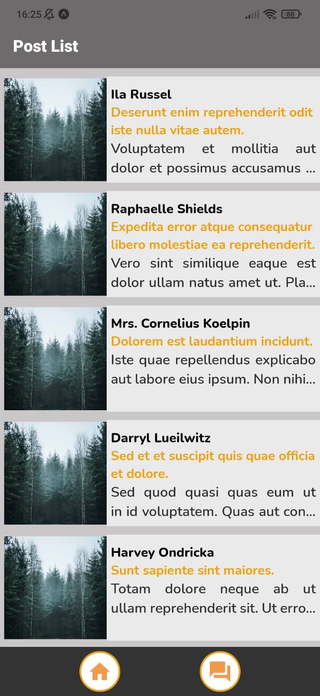

<h2><b>Sobre</b></h2> 

## Teste para desenvolvedor da [Coderockr](https://github.com/Coderockr)
---
<h2><b> Bibliotecas utilizadas no projeto</b></h2>

- [React Native](https://reactnative.dev/)
  - O framework **React Native** é utilizado para o desenvolvimento de aplicativos hibridos de forma nativa com JavaScript, dessa forma rodando o mesmo código em Android e IOS ao ser compilado.
- [Expo](https://expo.io/)
  - O **Expo** é um framework que nos auxilia no desenvolvimento de apps com React Native facilitando e otimizando o tempo de desenvolvimento do projeto.
  - Por padrão ele já nos trás algumas ferramentas configuradas, auxiliando no desenvolvimento e tornando mais prático.
  - No projeto o **Expo** foi utilizado para nos dar uma maior agilidade no desenvolvimento.
- [React Navigation](https://reactnavigation.org/)
  - A biblioteca **React Navigation** é utilizada para fazer o roteamento e navegação entre as páginas do app executado com React Native.
- [Styled Components](https://styled-components.com/)
  - O **Styled-Components** é uma biblioteca para a criação de componentes e estilização dos mesmos sendo muito utilizada hoje em dia para aplicações ReactJS e React Native, a mesma usa o CSS-in-JS.
  - No projeto a mesma foi utilizada para auxiliar na criação dos componentes das páginas e estilização das mesmas.
- [Axios](https://github.com/axios/axios)
  - O **Axios** é uma biblioteca para requisições HTTP.
  - No projeto, foi utilizada para trazer as informações da API.
---

<h2><b> Imagens do App</b></h2> 

---
<h2><b> Requisitos para rodar o projeto</b></h2>

- **Node.js** - version >= `16.5.0`
- **Yarn ou NPM** - version >= `7.19.1`
- **Expo** - version >= `44.0.0`

---
<h2><b> Como iniciar o Projeto:</b></h2>

1. Efetuar o clone deste repositório, colando em seu terminal, o seguinte comando: `git clone https://github.com/jaocordeiro/Coderockr-Test.git`

2. Instalar as dependências: `npm install` ou `yarn`

3. A aplicação será iniciada com o comando: `npm start` ou `yarn start`

